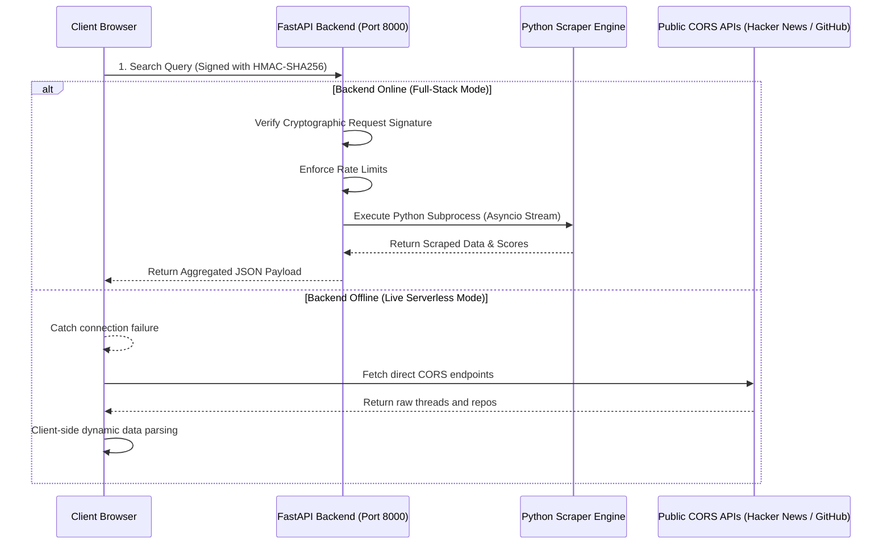

# DevPulse: Social-Scored Multi-Source Intelligence Dashboard

DevPulse is an enterprise-grade full-stack news and signal intelligence dashboard. It aggregates real-time social community metrics, prediction market odds, and code repositories from Reddit, Hacker News, Polymarket, GitHub, and YouTube.

---

## 🛠️ Architecture Overview

DevPulse operates in a **dual execution architecture** for maximum flexibility and serverless compatibility:



---

## ✨ Features

- **Asynchronous FastAPI Engine**: Utilizes non-blocking Python `asyncio` subprocess executors to stream analytics without blocking the server main event loop.
- **Hands-Free AI Audio Briefing**: Narrates executive summaries directly in the browser using the native HTML5 Web Speech Synthesis API.
- **Dynamic Category Donut Chart**: Interactive custom SVG segment chart displaying category distributions with mouse hover focus and floating tooltips.
- **Platform Share Bar Chart**: Scalable SVG chart drawing platform ratios dynamically.
- **Enterprise Security Middleware**: Built with custom rate-limiting, hardened HTTP security headers, CORS origin filtering, and request signature verification.
- **Automated Testing & linting**: Fully configured Vitest test suites checking parser engines under a clean `oxlint` compile check.

---

## 🚀 Quick Start

### 1. Installation
Install all backend and frontend dependencies recursively:
```bash
npm run install:all
```

### 2. Run the Full-Stack App
Boot both the Uvicorn FastAPI server and the Vite development server concurrently:
```bash
npm run start:fullstack
```
- Frontend will open at: [http://localhost:5173/](http://localhost:5173/)
- Backend will run at: [http://localhost:8000/api/docs](http://localhost:8000/api/docs)
